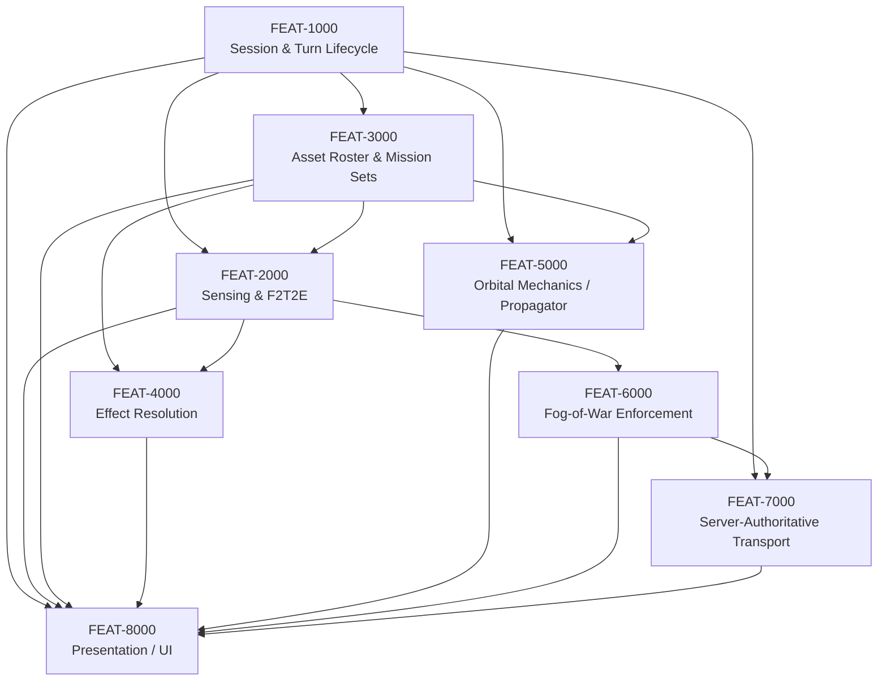

# Feature Dependency Graph — v1

- **Owned by:** `05-feature-decomposition` · **Status:** ✅ Authored, 2026-08-22

No circular dependency was found (a true DAG — checked by hand-tracing every edge listed on each
Feature's own Dependencies/Dependent Features fields in `03-feature-catalog.md` for a back-edge;
none exists).

## Critical path

**FEAT-1000 → FEAT-3000 → FEAT-2000 → FEAT-6000 → FEAT-7000 → FEAT-8000** (6 Features). This is
the longest chain because fog-of-war enforcement (FEAT-6000) can only be built once there is
belief-state content to filter (FEAT-2000), and transport (FEAT-7000) is scoped to carry only
already-filtered messages (FEAT-6000's own boundary) — nothing on this path can be reordered
without violating a real dependency (you cannot filter what doesn't exist, or transport a
filtered message before the filter exists).

Two shorter chains exist and are **not** on the critical path but still gate FEAT-8000:
`FEAT-1000 → FEAT-3000 → FEAT-2000 → FEAT-4000 → FEAT-8000` (5) and
`FEAT-1000 → FEAT-3000 → FEAT-5000 → FEAT-8000` (4).

## Blocking Features (high fan-out)

- **FEAT-1000** blocks all seven other Features directly or transitively — the single highest-
  leverage Feature to get right early; any defect here has the widest possible blast radius.
- **FEAT-3000** blocks FEAT-2000, FEAT-4000, FEAT-5000 (three Features depend on roster content
  existing before their own logic can be exercised).
- **FEAT-2000** blocks FEAT-4000 and FEAT-6000 — the second-highest fan-out node.

## Parallel opportunities

Once FEAT-1000 and FEAT-3000 are both done: **FEAT-2000 and FEAT-5000 can proceed in parallel**
(neither depends on the other). Once FEAT-2000 is additionally done: **FEAT-4000 and FEAT-6000
can proceed in parallel** (both depend only on FEAT-2000/FEAT-3000, not on each other). FEAT-5000
can run in parallel with the entire FEAT-2000→FEAT-4000/6000→FEAT-7000 chain, since its only
dependencies are FEAT-1000/FEAT-3000 — it converges with everything else only at FEAT-8000.

FEAT-8000 is a pure sink (no Feature depends on it) — confirmed consistent with its own catalog
entry ("Dependent Features: none").
