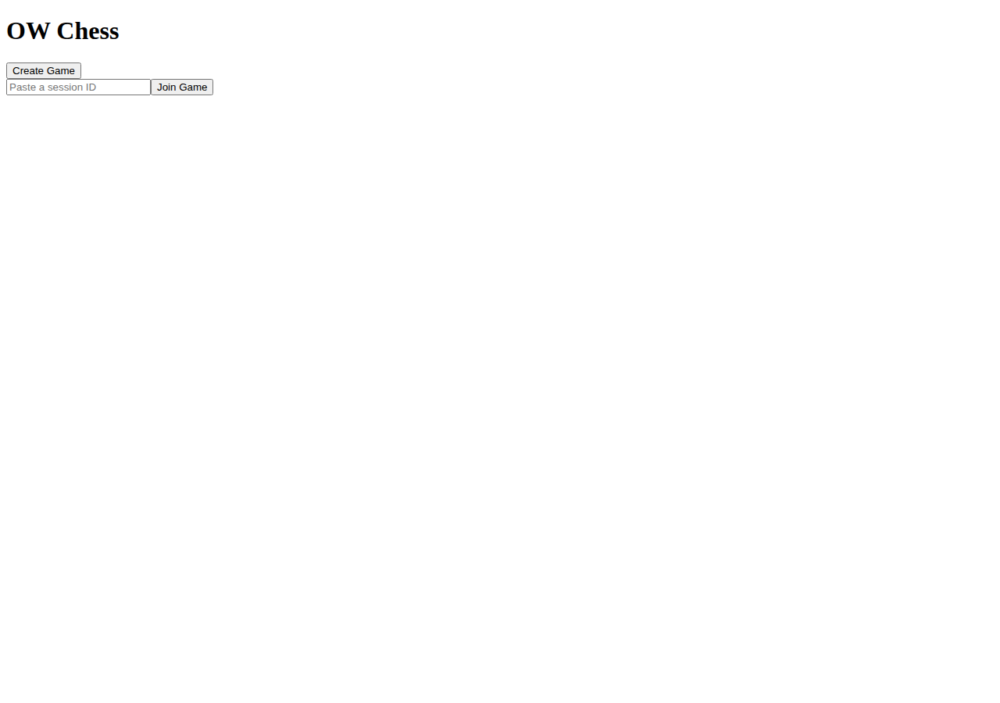
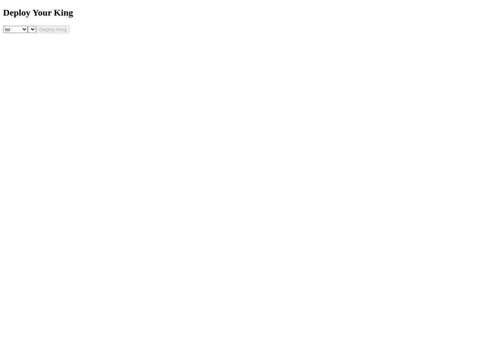
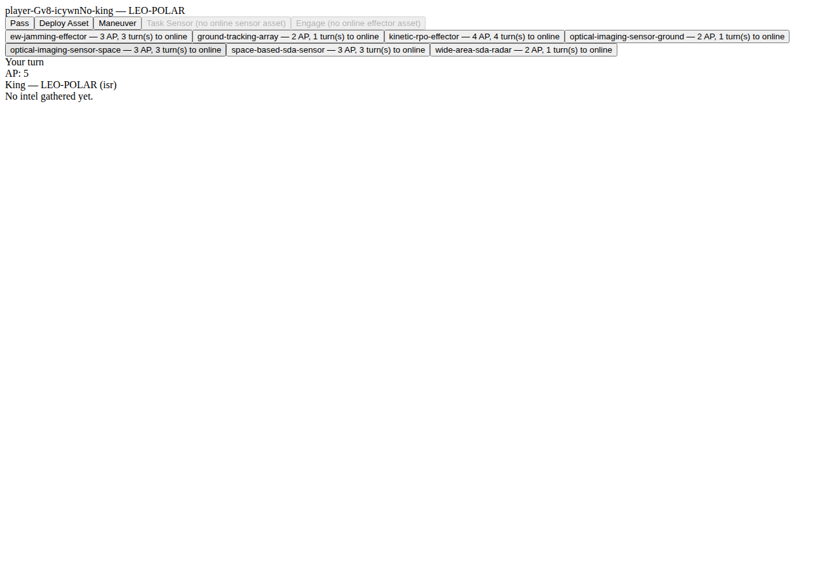

# 02 — The Interface

OW Chess's shipped interface is intentionally plain (no styling/CSS beyond browser defaults) —
every screenshot below is a genuine capture of the real running app, not a mockup. Both players
see an identical layout and identical actions; there is no separate "role" view.

## 1. Landing screen

- **Create Game** — starts a brand-new session and gives you (the creator) a unique session ID,
  embedded in your browser's address bar.
- **Join Game** — paste a session ID (get it from the other player, e.g. by reading them your
  browser's address bar URL, or copy-pasting it) and click Join to enter their session as the
  second player.

Both players end up looking at the same next screen: King deployment.

## 2. King Deployment screen

Every game starts by each player secretly choosing:
- A **mission set** (SATCOM, ISR, or PNT-lite) — this determines which asset types you'll be able
  to deploy later, and constrains which orbital regime your King can start in.
- An **orbital regime** for your King, from that mission set's allowed list.

Your opponent cannot see your choice — only whether you've submitted yet. Once you submit, you
see a waiting screen:

Once **both** players have deployed their King, the game begins and both players see the main
board.

## 3. The main game screen (six panels)

From top to bottom as currently laid out:

| Panel | Shows |
|---|---|
| **Orbital Board** | Your own assets (including your King) with their real orbital regime, and a second list of whatever you've learned about your opponent's assets so far via sensing ("Intel," described below). |
| **Action Menu** | Buttons for each action type: Pass, Deploy Asset, Maneuver, Task Sensor, Engage. A disabled button always says why in parentheses (e.g. "no online sensor asset"). |
| **Asset Tray** | Every asset type you can deploy (per your mission set), its AP cost, and how many turns until it comes online. Unaffordable options are shown disabled, never hidden. |
| **Mission/King Status** | Whose turn it is, your remaining Action Points (AP) this turn, and your King's current regime/mission set and denial-turn counter. |
| **Intel Panel** | A detailed list of everything you've learned about the opponent so far — the precision level (find/fix/track/target) and, once you've gotten to at least "fix" precision, their apparent regime. |
| **Event Log** | A running, turn-numbered history of every resolved action in the game. |

## Reading the Orbital Board

Each of your own assets is listed as `<asset-id> — <regime>`. Each opponent contact you've
detected is listed as `<contact-id> — <apparent-regime-or-"presence only"> (<precision>)`, and
gets an `[reported]` tag if the entry has been corrupted by an opponent Deceive effect — see the
glossary in `05-troubleshooting-and-glossary.md`.

## Continue

`03-first-game.md` walks through actually playing — including one confirmed, as-shipped
limitation of the current interface worth knowing about before you start.

> Sources: `client/src/components/Landing.tsx`, `KingDeploymentPicker.tsx`, `App.tsx`,
> `OrbitalBoard.tsx`, `ActionMenu.tsx`, `AssetTray.tsx`, `MissionKingStatus.tsx`,
> `IntelPanel.tsx`, `EventLog.tsx`. Screenshots captured live via Playwright against the built
> app (commit `b8ec3bd`) this session. Satisfies FR-9110.
