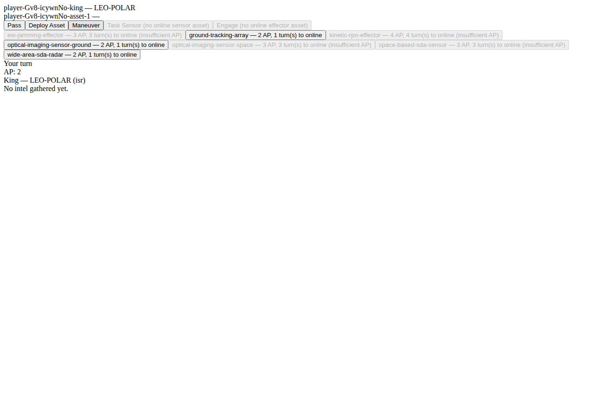

# 03 — Your First Game

This walks two real players through starting a game and playing it as far as the shipped
interface currently supports. **Read the "Known limitation" box below before you start** — it's
an honest, code-verified statement of what you can and cannot currently finish through the UI,
not a bug in this manual.

## Step 1 — Create and join a session

Player 1 opens `http://localhost:3000`, clicks **Create Game**, and shares the session ID (the
address-bar URL, or just the ID portion) with Player 2. Player 2 opens the same base address,
pastes the session ID into the Join box, and clicks **Join Game**. Both players now see the King
Deployment screen (`02-interface.md`).

## Step 2 — Deploy your King (secretly)

Each player independently picks a mission set and a starting orbital regime for their King, and
clicks **Deploy King**. Your opponent never sees your choice — only whether you've submitted.

Real example from this walkthrough: Player 1 chose mission set `isr`, regime `LEO-POLAR` (ISR's
only allowed King regime). Player 2 chose a different mission set. Once both submit, the game
transitions to the active board for both players simultaneously.

## Step 3 — The active game

The player whose turn it is sees "Your turn" and a positive AP total in the Mission/King Status
panel; the other sees "Opponent's turn" and every action-menu button disabled with reason "not
your turn."

## Step 4 — Deploying an asset

On your turn, the **Asset Tray** lists every asset type your mission set allows, each showing its
AP cost and turns-to-online. Clicking an affordable one deploys it immediately (no confirmation
step) and deducts its AP cost from your total.

Look at the Orbital Board's own-assets list in that screenshot: the newly-deployed asset shows as
`<asset-id> — ` with **nothing after the dash**. That's not a rendering glitch — see the box
below.

## ⚠ Known limitation, confirmed this session

**The shipped Deploy button does not currently ask you to pick a starting orbital regime for the
new asset**, and the server accepts the deployment anyway — the asset is created with no regime
at all (confirmed by reading `server/src/engine/deployAction.ts` and reproduced live above,
commit `b8ec3bd`). The asset still exists, still has its chain roles, and still counts toward AP
spending and time-to-online, but it doesn't have a real position.

**The Task Sensor, Maneuver, and Engage buttons have the same class of gap, one level further:**
they only become clickable once you have an *online* eligible asset (which requires waiting the
listed number of turns), and reading `taskAction.ts`/`maneuverAction.ts`/`engageAction.ts`
confirms each requires specific target information (which asset, which orbital regime, which
opponent asset, which of the Five D's effect) that the current Action Menu button never collects
— clicking the button sends the action with no target data, which the server rejects.

**Practical effect:** a real player can, today, create a session, join it, secretly deploy a King,
reach the active board, take turns, deploy an asset (with the caveat above), and Pass. A full
find-fix-track-target-engage cycle to an actual win condition (destruction, mission denial,
resignation, or timeout-tiebreak — see `04-actions-reference.md`) **cannot currently be completed
through the shipped web interface** — the game engine itself supports it (and it's covered by the
server's automated test suite), but the client UI hasn't yet been built out to collect the
targeting information those three actions need.

This has been reported for remediation (see this module's traceability entry in
`06-manual-traceability.md`) — this manual documents the interface exactly as it ships today, per
this corpus's own as-built-only rule, rather than describing a game flow you can't actually
complete yet.

## What you *can* verify yourself, end to end, today

1. Both players can create/join a session and reach the active board (verified above).
2. Turn alternation and AP accounting are real and visible (Mission/King Status panel updates
   immediately after every accepted action).
3. Passing your turn (`Pass`, always legal on your turn) hands control to your opponent.
4. Your opponent's disconnect/reconnect produces the disconnect banner with Wait/Cancel choices
   (`App.tsx`) — not re-demonstrated with a screenshot in this pass, but this behavior predates
   this walkthrough and is independently VERIFIED (VR-7010).

> Sources: live Playwright session against the built app, commit `b8ec3bd` (this session);
> `server/src/engine/deployAction.ts`, `taskAction.ts`, `maneuverAction.ts`, `engageAction.ts`;
> `client/src/App.tsx`, `client/src/components/AssetTray.tsx`, `ActionMenu.tsx`. Partially
> satisfies FR-9420 (walkthrough as far as the shipped UI supports); the gap above is the reason
> FR-9420 cannot yet be marked fully satisfied — see `06-manual-traceability.md`.
