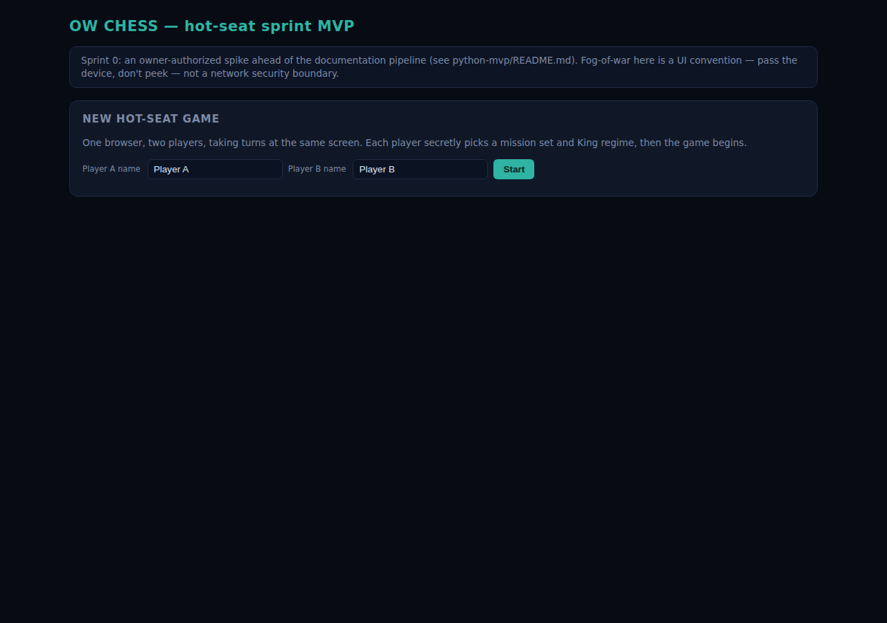

# OW Chess — Sprint 0 hot-seat MVP (Python)

**This is a deliberate, bounded exception to the project's own documentation-driven pipeline**
(G1–G6, `.claude/skills/README.md`) — an owner-authorized spike that ran ahead of
vision→architecture→requirements→spec→plan, not a precedent for skipping the pipeline going
forward. See the task brief that commissioned it for the full rationale. Once this proves the
game, the Python-stack decision goes through the pipeline properly (new ADR superseding
`docs/architecture/adr/ADR-0001-tech-stack.md`, GDS-03 update, Master Build Plan re-cut) before
any further code is written.

## What this is

One FastAPI process, one browser tab, two players sharing the same machine and taking turns —
**hot-seat**, not networked multiplayer. Game logic lives in `engine/` modules that mirror the
TypeScript build's GDS-03 responsibility split (`TurnManager`, `GameEngine`, `Propagator`,
`BeliefState`, `EffectResolver`) even though nothing here sits behind a network boundary yet —
so a later multiplayer rework is transport added around existing modules, not a redesign.

Fog-of-war is a **UI convention**, not a security boundary: between turns, a "pass the device"
screen (`templates/reveal.html`) gates the board behind a click, and the board only ever renders
the *active* player's own state plus their belief-derived view of the opponent (never the
opponent's true state) — see `app.py`'s `_board_context` and `engine/belief_state.py`. There is
no server-side filtering against a second, independent client, because there is no second client.

## Run it

```
cd python-mvp
pip install -r requirements.txt
python3 -m uvicorn app:app --reload
```

Open `http://127.0.0.1:8000/`. Two players, same tab, pass the laptop back and forth.



**For a full step-by-step first game with a real screenshot at every stage — deploy, F2T2E
tasking to `target` precision, Engage, and an actual win screen — see
[`docs/FIRST-GAME.md`](docs/FIRST-GAME.md).**

Run the engine smoke tests (no server needed):

```
python3 tests/test_engine_smoke.py
```

## What's playable (demonstrated live, not just asserted — see the session transcript this
sprint produced by driving the running app with curl)

- **King deployment**: pick a mission set (satcom/isr/pnt-lite), which fixes King regime and
  which asset types you can deploy later. Sequential with a reveal gate between players — hot-seat
  stands in for FR-1210's "secret, simultaneous" requirement.
- **Deploy**: any asset type your mission set allows, into any regime within that template's
  `regimeAffinity` — rejected otherwise (the TS build's `deployAction.ts` never checked this
  server-side; this port does).
- **Task (F2T2E)**: repeated tasking climbs belief precision find→fix→track→target, capped by the
  sensor's own chain-role ceiling, gated on the sensor being online. Confirmed live: 4 tasking
  calls against a target regime advanced precision from nothing to `target` on two real opposing
  assets.
- **Maneuver**: any online asset (including the King) can maneuver to any of the 9 regimes, using
  FS-104's real altitude+plane cost table; a second maneuver is rejected while one is in progress.
- **Engage**: requires `target`-level belief precision (FR-4002); Destroy flags the target
  destroyed; Disrupt/Deny/Degrade add a duration-tracked effect entry; effector template gates
  which effects are even offered. Confirmed live: a `destroy` engagement against a King with
  `target` precision ended the game.
- **Win conditions actually fire**: destruction, resignation, and mission-denial (6 consecutive
  King-denied turns) are all checked after every accepted action (including `pass`), and flip the
  session to `ended` with a real winner shown on a game-over screen. Confirmed live for
  destruction and resignation — see `docs/screenshots/07-game-over.png`, or the full walkthrough
  in `docs/FIRST-GAME.md`.
- **Event log**: every accepted action appends a real entry, rendered on the board and on the
  game-over screen — not always-empty like the TS build's unwired `session.eventLog`.
- **A real visible board**: server-rendered SVG, three regime rings (LEO/MEO/GEO) x three plane
  sectors, own assets and opponent belief-contacts plotted on it. This is the "simpler
  placeholder" the task brief explicitly allowed in place of porting ZabSpaceExercise's canvas
  globe — that sibling project wasn't present in this environment to port from. It is still a
  real board: the TS build shipped with *zero* CSS anywhere and unstyled flat `<div>` lists
  (CLAUDE.md's Known Good Behavior section).
- **Resign has a real UI path** (button, confirm dialog) — the TS client's `ActionKind` narrowed
  `ActionType` and dropped `resign` entirely; this port's form always includes it.

## The two defects this sprint was told to fix, not port

1. **`pass` firing no turn-end hooks.** The TS `GameEngine` kept a second, hookless `TurnManager`
   map separate from the one `createGameEngine.ts` wired hooks onto, and drove `pass` against the
   hookless one. This port has exactly one `TurnManager` per session
   (`engine/game_engine.py:turn_manager_for`), constructed once and shared by every action path,
   so `pass` and AP-exhaustion both call the same `advance_turn()`. Covered by
   `tests/test_engine_smoke.py::test_pass_advances_turn_and_fires_hooks`.
2. **Deceive corrupting the deceiver's own belief map.** The TS `engageAction.ts` called
   `applyDeception(effectorObserverState, target.assetId, falseRegime ?? target.trueRegime, ...)`
   — the attacker "corrupting" its own belief entry about the opponent's asset with that asset's
   *real* regime (since the client never sent `falseRegime`), which is a no-op dressed as an
   effect. **Sprint-0 spec call** (flagged for `06-feature-specification` once the pipeline
   resumes, per the task brief): Deceive now plants a false regime for the *effector's own asset*
   in the *target's owner's* belief map — `engine/belief_state.py`'s module docstring has the full
   reasoning; `engine/effect_resolver.py`'s `deceive` branch and
   `tests/test_engine_smoke.py::test_deceive_corrupts_victim_belief_not_deceivers_own` show it.
   The live curl session did not exercise this path end-to-end through a full game, because the
   shipped content has a real asymmetry worth naming plainly rather than glossing over: only
   `ew-jamming-effector` can apply Deceive, and it belongs to the `satcom`/`pnt-lite` mission
   sets, neither of which includes any asset type with the `target` chain role — so a `satcom` or
   `pnt-lite` player can never reach the precision Engage requires against anything, Deceive
   included. This is inherited content shape from the existing roster (`memory.md`), not
   something introduced here, and is out of this sprint's scope to redesign; the unit test above
   is the evidence for the fix itself, isolated from that separate, pre-existing gap.

## Explicitly out of scope for this sprint (deferred, not dropped)

- Real WebSocket multiplayer transport, two independent clients, server-side fog-of-war
  enforcement against an untrusted client. Hot-seat's reveal gate is not that boundary.
- Accounts, persistence beyond in-memory (state lives in one module-level `AppState`; restarting
  the process loses the game, matching NFR-6100's "no DB in v1").
- The full documentation pipeline's ladder for this code (no FS-###, no IP-####) — this is the
  spike that will inform those once written.
- Timeout/tiebreak win condition (60-turn cap) — implemented in `game_engine.py` per the original
  FR-1420 rule, but not exercised in the sprint's live demonstration (would need 60+ turns).
- Regime affinity enforcement on `task`'s target regime — mirrors the TS build's own documented
  gap (`memory.md`'s "roster depth is presently closer to cosmetic than mechanical" caveat); not
  one of the two defects this sprint was scoped to fix.

## Files

- `engine/` — the ported modules (types, template_registry, turn_manager, belief_state,
  propagator, effect_resolver, actions, game_engine, board_svg).
- `content/` — a copy of `server/src/content/**/*.json` (the TypeScript build's authoritative
  mission-set/asset-type/effect-definition data), so this sprint doesn't depend on the TS server
  existing at runtime. If the two ever disagree, `server/src/content/` is still the source of
  truth for the eventual Python rewrite.
- `app.py` — the FastAPI routes, hot-seat stage machine, and board-context assembly.
- `templates/` — Jinja2 templates, dark-theme inline CSS (no build step, no CDN dependency).
- `tests/test_engine_smoke.py` — engine-level tests proving both fixed defects and the
  now-reachable win condition.
- `docs/FIRST-GAME.md` — a full step-by-step play walkthrough with a real screenshot at every
  stage; `docs/screenshots/` holds the images it embeds.
