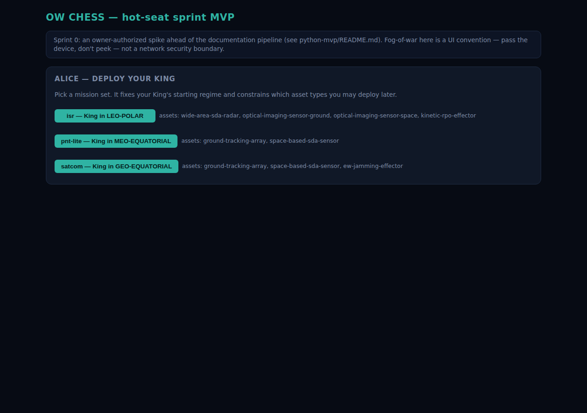
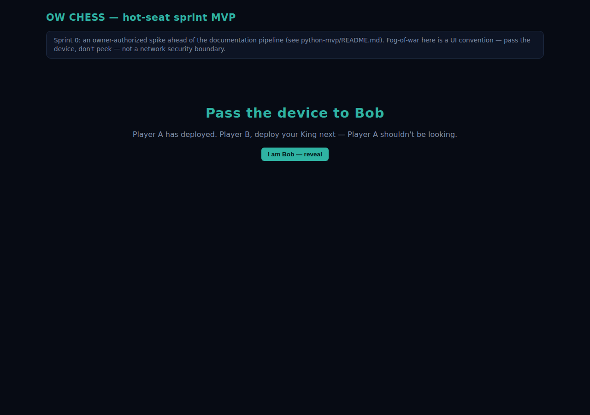
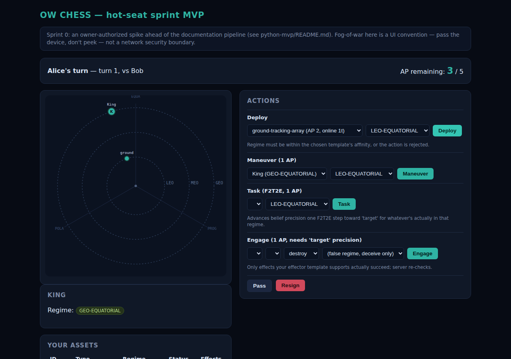
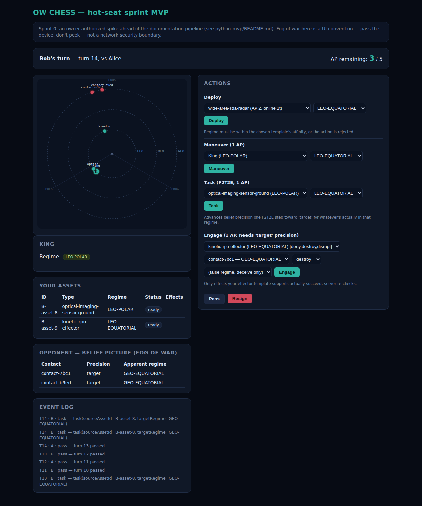
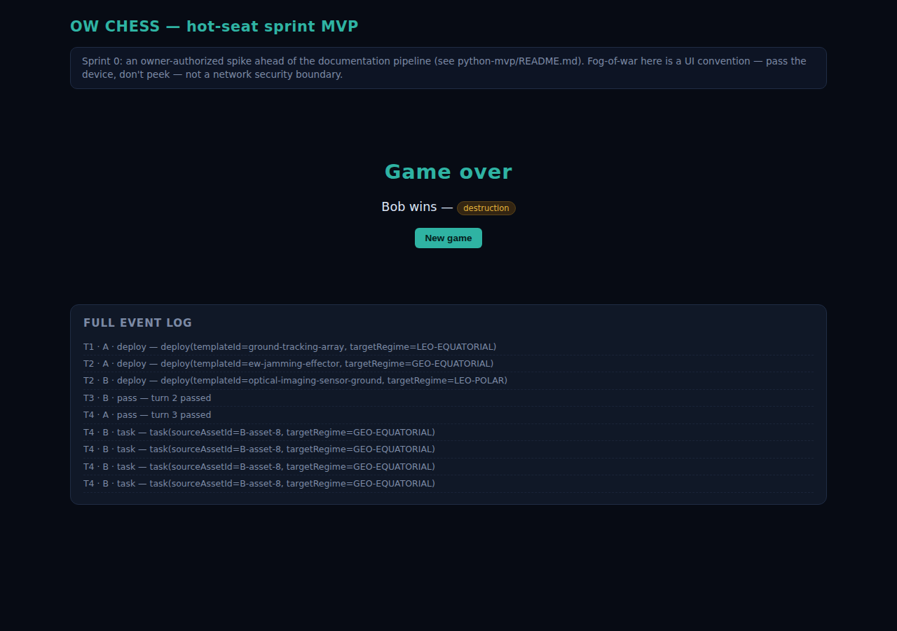

# Playing your first hot-seat game

Every screenshot below is a real browser render — headless Chromium (Playwright), driven against
a locally running instance of this app on `76e0d91`'s successor commit — not a mockup. If your
own run looks different, something's actually wrong; open an issue rather than assuming the
screenshot is aspirational.

## Step 1 — Install and start the server

```
cd python-mvp
pip install -r requirements.txt
python3 -m uvicorn app:app --reload
```

You should see Uvicorn print `Application startup complete.` and `Uvicorn running on
http://127.0.0.1:8000`. Leave this terminal open — it's the running game.

Open `http://127.0.0.1:8000/` in a browser:


Type both players' names (or leave the defaults) and click **Start**.

## Step 2 — Deploy your Kings

Each mission set fixes a single King regime, so this is a one-click pick rather than a form —
Alice picks `satcom`:



After she deploys, the app shows the pass-the-device gate instead of jumping straight to Bob's
screen — this is Sprint 0's fog-of-war convention, a UI gate, not a network security boundary
(see the README's "What this is" section):



Bob clicks through, picks his own mission set (`isr`), and once both Kings are down the game goes
active — turn 1, Alice to move.

## Step 3 — The board and the action panel



Left column: the orbital board (three rings for LEO/MEO/GEO, three sectors per ring for
Equatorial/Prograde/Polar), your King, your asset roster with status, and your belief picture of
the opponent (empty until you Task something). Right column: the five action forms plus Pass and
Resign. AP remaining and whose turn it is are always shown at the top.

**Deploy** costs AP and time-to-online from the template; the regime you pick must be inside that
template's own affinity or the server rejects it outright (this Python port checks that
server-side — the original TypeScript build didn't, see the README's defect list).

## Step 4 — Task a sensor to build your belief picture (F2T2E)

Each **Task** action advances your belief precision on whatever's actually present in the targeted
regime by one step: find → fix → track → target, capped by your sensor's own chain-role ceiling.
After four Task actions against the same regime, two of the opponent's real assets have climbed
all the way to `target` precision — real contacts, plotted on the board, listed in the belief
table:


Belief entries **decay** if you don't refresh them within 5 turns (one level per stale window) —
if you wait too long between Task actions, re-task before trying to Engage.

## Step 5 — Engage

Engage requires `target`-level precision on the specific asset you're targeting (FR-4002) — the
target dropdown only lists contacts that actually qualify, and the effect dropdown only offers
effects your effector template actually supports (a `kinetic-rpo-effector` never offers Deceive,
for instance):



## Step 6 — Win the game

A successful `destroy` against a King ends the game immediately — win conditions are checked
after every accepted action, including `pass`, so the game can actually reach this screen (the
bug this whole sprint exists to fix — see the README):



The full event log stays visible underneath, so you can see exactly how the game unfolded.

## Other ways to win, and other actions

- **Maneuver** any online asset (including your King) to a different regime — costs 1 AP plus a
  turns-to-complete delay from the real altitude/plane cost table; a second maneuver can't be
  queued while one's in progress.
- **Pass** ends your turn immediately even with AP left.
- **Resign** ends the game immediately in your opponent's favor — there's a confirm dialog so a
  stray click doesn't cost you the game.
- **Mission denial**: if a player's King sits under an active Disrupt/Deny/Degrade effect for 6
  consecutive turns, that's also a win for the opponent — this wasn't exercised in the screenshots
  above (it takes many turns to set up) but is covered by an engine-level test
  (`tests/test_engine_smoke.py`).

## Two honest caveats from actually playing this

- **Asset IDs are assigned from one counter shared across every game in the process**, not reset
  per-game (matches the original TypeScript build's behavior) — so don't assume your first
  deployed asset is `A-asset-1` if you've started a fresh game in the same running server before;
  the ID shown in **Your assets** and in the action dropdowns is always the real one to use.
- **Deceive is real but hard to reach with the shipped content roster**: only
  `ew-jamming-effector` can apply it, and neither mission set that carries it (`satcom`,
  `pnt-lite`) includes a `target`-capable sensor — so a `satcom`/`pnt-lite` player can build belief
  precision up to `track` at best and can never actually Engage anything. This is a pre-existing
  content-roster gap (see `memory.md`), not something this sprint introduced or was scoped to fix;
  the Deceive *mechanic* itself is proven correct by an isolated unit test instead
  (`tests/test_engine_smoke.py::test_deceive_corrupts_victim_belief_not_deceivers_own`), since no
  full playthrough can currently reach it.
